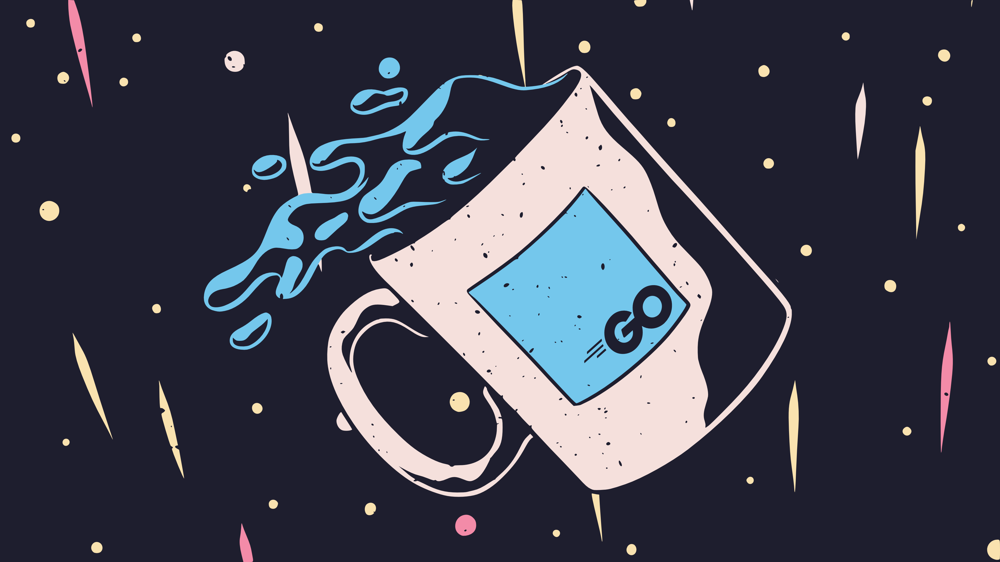

<div align="center">
    <h2> My projects 👨‍💼</h2>
    
</div>

I am currently working as a developer and contributor at [Catppuccin](https://github.com/catppuccin). 

I initially started out by porting [joplin](https://github.com/catppuccin/joplin), but now I am also maintaing ports for [vscode](https://github.com/catppuccin/vscode), [sublime-text](https://github.com/catppuccin/sublime-text) and [bat](https://github.com/catppuccin/bat). I have also contributed and ported [spicetify](https://github.com/catppuccin/spicetify).

I am currently working on [CLI for Catppuccin](https://github.com/catppuccin/cli) with my friends over at Catppuccin. We're writing this in Go. 

<div align="center">
    <h2>My previous projects</h2>
</div>

I have previously completed some projects, most of which were either personal projets or were created for university submissions. I mostly worked on writing the middleware and backends of these projects but also had some role in the frontend as well. 

```admonish warning title="Warning!!!" 
The quality of these projects either ranges from good to war crimes against programming. There is no in-between. 
```

- [blog site](https://github.com/ghostx31/blog-site)
- [talkies site](https://github.com/ghostx31/talkies-site)


