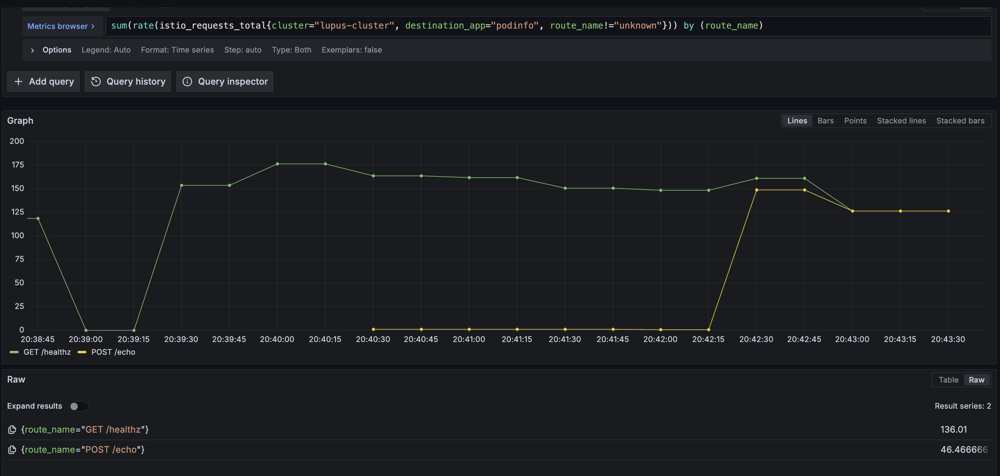

## Table of contents

## Introduction
I have been messing around with Istio recently and turns out, its a brilliantly designed service mesh! Sure, the learning curve can be a bit steeper unlike Linkerd which is pretty much plug-and-play but Istio is definitely has its perks.

After having worked with Istio to use it as a Gateway API controller, I looked into something else. Using Istio to show per-route metrics for applicatins.

And its pretty straightforward _(well, kinda)_. 

### What are per-route metrics?
Say your application serves traffic on two endpoints - `GET /healthz` and `POST /echo`, and you need to determine how many requests, or even latency per request each of these endpoints is receiving. This is where per-route metrics come into the picture. 

We can use Istio to show these metrics, and more using its **Telemetry API** and **Kubernetes Gateway API**. 

Gateway API is the newest addition in Kubernetes SIG which is essentially an upgraded version of Ingress. It supports not only host based routing but also header based and even support filters like rewriting the URL or adding custom headers before forwarding the traffic to your applications. 

You can read more about it from https://gateway-api.sigs.k8s.io/.

Here's a sneak into how it looks like on Grafana:


Let's see how that works!

> I am going to use this application called podinfo which is a microservice template app written in Go. You can find it at [stefanprodan/podinfo](https://github.com/stefanprodan/podinfo).


## Istio installation
First and foremost, installing Istio. I used Helm for installation but you can use its istioctl CLI or even Kubernetes manifests for it. 

I deployed Istio in the Ambient Mode which is essentially a sidecar-less pattern which uses a node-level proxy to route traffic to your applications. 

The major plus side of this approach is that the proxy is injected without restarting the application pods and we can gradually keep adding applications to the service mesh without disrupting the traffic flow. 

### Installing via Helm charts
- **Configure the istio Helm repo:**

```yml
helm install istio-base istio/base -n istio-system --create-namespace --wait && helm repo update
```

- **Install the Istio base CRDs:**

```yaml
helm install istio-base istio/base -n istio-system --create-namespace --wait
```

- **Install Gateway API CRDs:**

```yaml
kubectl get crd gateways.gateway.networking.k8s.io &> /dev/null || \
  kubectl apply -f https://github.com/kubernetes-sigs/gateway-api/releases/download/v1.3.0/standard-install.yaml
```

- **Install the control plane:**

```yml
helm install istiod istio/istiod --namespace istio-system --set profile=ambient --wait
```

- **Install the CNI node agent:**

```yml
helm install istio-cni istio/cni -n istio-system --set profile=ambient --wait
```

> **Note: If you use GKE or EKS, there are platform specifc steps you need to follow which can be found [here](https://istio.io/latest/docs/ambient/install/platform-prerequisites/)**

> You can also find all installation steps at: https://istio.io/latest/docs/ambient/install/

- **Install the data plane:**

```yml
helm install ztunnel istio/ztunnel -n istio-system --wait
```

Once done, we're ready to move forward with the actual steps to get per-route metrics working. 


## Enrolling your application in the service mesh and enabling L7 metrics

Say your applications are deployed in the `podinfo` namespace. You can inject L3 proxy for all applications in this namespace by adding the label `istio.io/dataplane-mode=ambient` in the namespace. This enrolls your application in the service mesh. 

Now to support actual L7 traffic which is where we'll get the route metrics from, we'll inject something called a Waypoint proxy. This is essentially a Kubernetes Gateway represented as `kind: Gateway` with the `gatewayClassName` set to `istio-waypoint`. 

We apply the following Gateway manifest to get a waypoint running:

```yaml
apiVersion: gateway.networking.k8s.io/v1
kind: Gateway
metadata:
  name: podinfo-waypoint
  namespace: podinfo
spec:
  gatewayClassName: istio-waypoint
  listeners:
  - allowedRoutes:
      namespaces:
        from: Same
    name: mesh
    port: 15008
    protocol: HBONE
```

Now, we need to label the namespace to use this waypoint. This can be done by labelling the namespace with `istio.io/use-waypoint: podinfo-waypoint`

This enrolls the namespace within the Istio system to use the `podinfo-waypoint`. 


Now, onto the main part which is where it gets interesting. If you add Istio's scrape endpoints to your metrics collector, prometheus in my example, you get `istio_requests_*` metrics. These don't expose the metrics that we want by default, but we can expand them to show exactly what we want. 

Istio provides something called a Telemetry API which can be used to extend the envoy proxy it uses for the Waypoint Gateway. That's exactly what we're going to do!

We first need to extend the Envoy proxy used in the Waypoint proxy using a `WASMPlugin`. We use the Attributegen WASM Plugin here. 

Here's how to do that:

```yaml
apiVersion: extensions.istio.io/v1alpha1
kind: WasmPlugin
metadata:
  name: podinfo-wasmplugin
  namespace: podinfo
spec:
  targetRefs:
    - kind: Gateway
      group: gateway.networking.k8s.io
      name: podinfo-waypoint
  url: https://storage.googleapis.com/istio-build/proxy/attributegen-359dcd3a19f109c50e97517fe6b1e2676e870c4d.wasm # Name of the wasm plugin we want to use
  imagePullPolicy: Always
  phase: AUTHN
  pluginConfig:
    attributes:
    - output_attribute: "istio_operationId"
      match:
        - value: "GET /healthz" # Name to show on the metric
          condition: request.method == 'GET' && request.url_path == '/healthz'
        - value: "POST /echo" 
          condition: request.method == 'POST' && request.url_path == '/echo'

```

This might seem complicated, but the main part of this are `spec.url` which is the URL of a WASM plugin. And then `pluginConfig.attributes[*].match[*]` which is where you define the logic on how the request needs to be get processed.

Then, we extend the `istio_requests_*` metrics using a Telemetry plugin. Here's how its done:
```yaml
apiVersion: telemetry.istio.io/v1
kind: Telemetry
metadata:
  name: podinfo-telemetry
  namespace: podinfo
spec:
  metrics:
    - overrides:
        - match:
            metric: REQUEST_COUNT
            mode: CLIENT_AND_SERVER
          tagOverrides:
            route_name:
              value: filter_state['wasm.istio_operationId']
      providers:
        - name: prometheus

```

Here, we're just adding the operation name `istio_operationId` from `WASMPlugin` configuration to extend the `REQUEST_COUNT` metrics exposed by Istio. 

Apply this final yaml and we're ready. 

## Visualizing the metrics
You need to add your Istio's endpoint to your prometheus scrape config, something like this:

```yaml
- job_name: 'istiod'
  kubernetes_sd_configs:
  - role: endpoints
    namespaces:
      names:
      - istio-system
  relabel_configs:
  - source_labels: [__meta_kubernetes_service_name, __meta_kubernetes_endpoint_port_name]
    action: keep
    regex: istiod;http-monitoring

- job_name: 'envoy-stats'
  metrics_path: /stats/prometheus
  kubernetes_sd_configs:
  - role: pod

  relabel_configs:
  - source_labels: [__meta_kubernetes_pod_container_port_name]
    action: keep
    regex: '.*-envoy-prom'
```

Now, to test this setup. Setup a curl script to hit a GET request on the Podinfo service at `/healthz`and another to hit a POST request at `/echo`. 

This can be done by simply doing something like:

```shell
while true; do curl http://podinfo-svc.podinfo:9898/healthz; done
# OR
while true; do curl -X POST -d "test" http://podinfo-svc.podinfo:9898/echo; done
```

Then run 
```
sum(rate(istio_requests_total{destination_app="podinfo", route_name!="unknown"})) by (route_name)
``` 
to see your metrics! This query essentially returns the rate of change of requests over a time period on the routes, which are returned by the `route_name` label. 

Since none of this is documented in a step-by-step manner in Istio docs, I hope this helps clear out soomeone's doubts :)

## References
